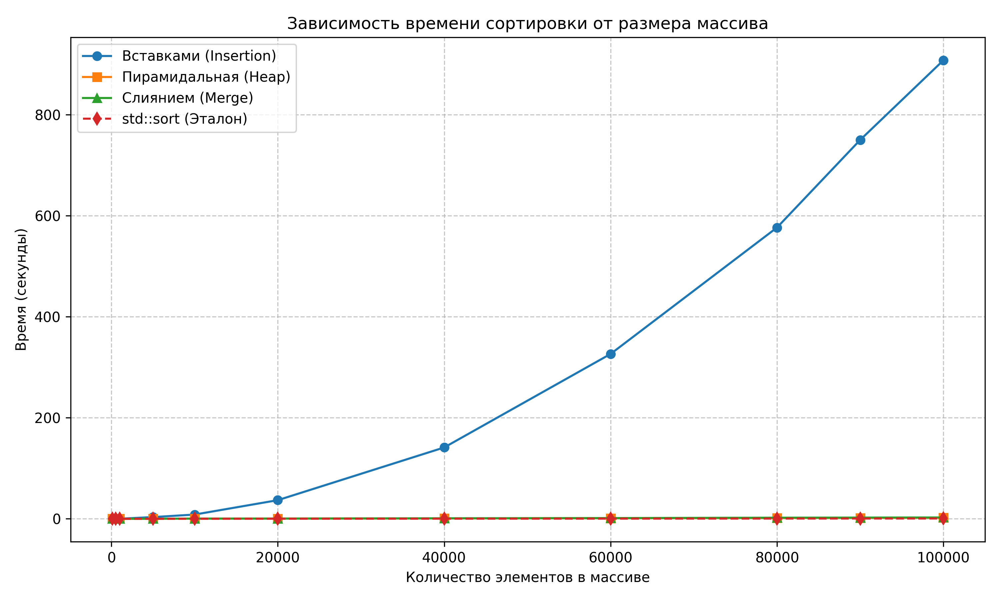

# Programming Methods Lab1

Вариант 23.

## Документация
Cгенерирована с помощью Doxygen:
* [Инструкция по коду (Doxygen)](html/index.html)

## Исходный код
* [GitHub Repository](https://github.com/bloodyEmmy/Programming-Methods-Lab1)

## График результатов
График зависимости времени выполнения алгоритмов (Вставками, Пирамидальная, Слиянием и std::sort) от размера входного массива:

